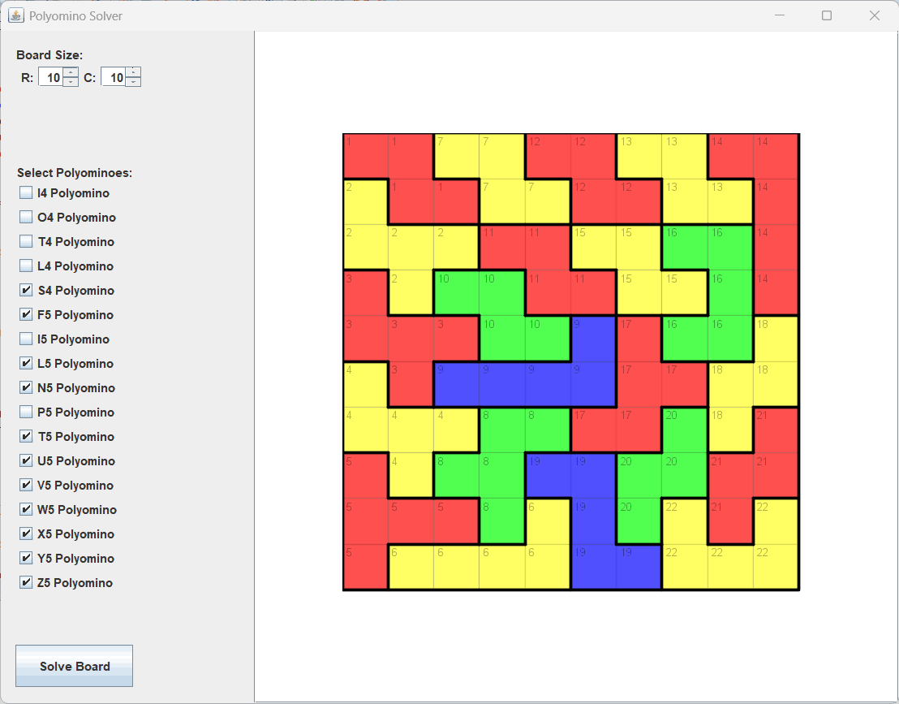

# Introduction
**PolyominoApp** is a simple java Swing application designed to solve and visualize polyominoes tiling.\
[Polyominoes](https://en.wikipedia.org/wiki/Polyomino) are planar polyforms whose cells are squares.

An interesting problem related to polyominoes is the rectangle tiling, an exact cover problem that can be solved efficiently by Donald Knuth's [Dancing Links (DLX) algorithm](https://arxiv.org/abs/cs/0011047).

# Running PolyominoApp
Just run [ant](https://ant.apache.org/) to build and run PolyominoApp application.

# Benchmarking different algorithms
Two algorithms are available, DLX implemented by *DLXPolyominoSolver* and recursion with pruning impossible holes early implemented by *PolyominoSolver*.

Executing the command ``java -cp classes PolyominoApp -benchmark`` may provide the following output running on CPU AMD Ryzen 7 8845HS:

```
Benchmarking DLXPolyominoSolver.solve()
....
Average solver time: 3.6526 ms
Max solver time: 4.9984 ms
----------------------
Benchmarking PolyominoSolver.solve()
...
Average solver time: 2747.555933333333 ms
Max solver time: 8198.0437 ms
```

# App features
On the left panel, users can:

♦ Set the board size effortlessly using spin controls for rows and columns. \
♦ Choose which polyomino pieces to include from an organized checklist, from small shapes to complex pentominoes. \
♦ Start solving instantly with a prominent "Solve Board" button.

The main workspace on the right showcases the solution in a large, colorful grid where each polyomino is displayed in a distinct color, making it easy to visually identify pieces at a glance.

# Screenshot
This is an example of solution after pushing "Solve Board" button:


